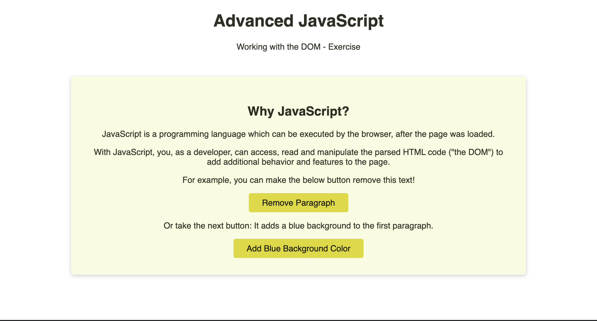
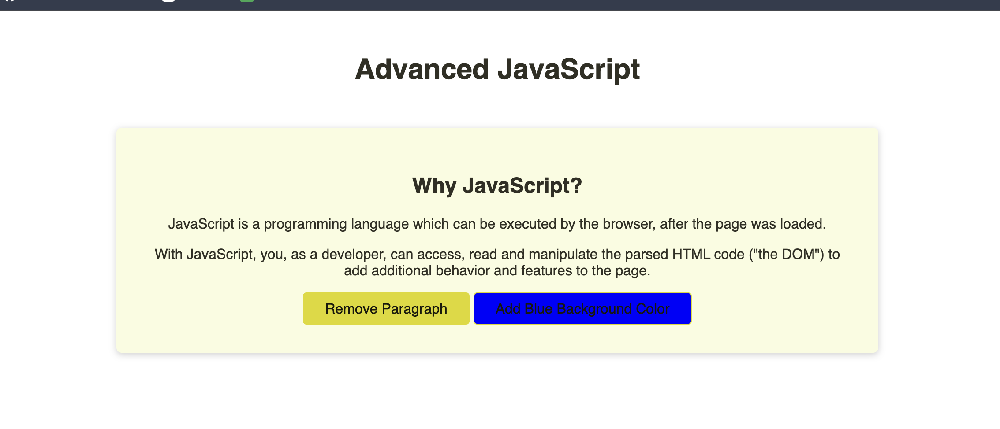
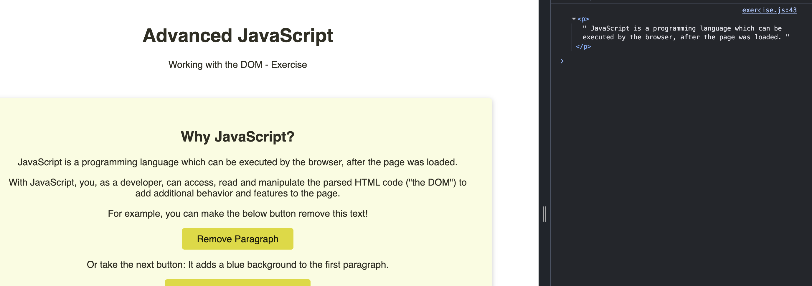

# 100 Days Of Code Web Development Bootcamp
>
> 100 Days Of Code - Web Development Bootcamp by Maximilian Schwarzmüller Udemy Course. 
>
>[Link to course](https://www.udemy.com/course/100-days-of-code-web-development-bootcamp)
>
> [Github repo](https://github.com/academind/100-days-of-web-development/tree/04-html-css-first-practice-summary)


#### HTML [Basics](https://developer.mozilla.org/en-US/docs/Web/HTML/Reference/Elements ): 
Hyper Text Markup Language 


### Quiz 1: 
What is HTML all about?
A: HTML is used to define and describe your content and page structure.

In its most basic form: What exactly is a "web page"?
A: A *.html file thats served by a server

How is a web page loaded by the browser?
A: The HTML content is stored in a file on a remote server and sent by the server to the browser when the user vists the page

What's an "HTML Element"?
A: An annotated piece of content: HTML Tags (WHich include the name of an element) + content

Why do we need HTML elements?
A: HTML elements annotate content and provide more meaing to it. 

Which HTML elements can you use?
A: All the standardised HTML elements 

What's the idea behind "HTML attributes"?
A: HTML attributes allow you to addextra configuration to an element 


#### CSS basics 
Cascading Style Sheets


When not using inline styles (via the style attribute), CSS code typically looks something like this:

p {
    font-family: sans-serif;
    text-align: center;
}
This code is formatted to be more readable. Theoretically, you could also write it like this:

p {font-family: sans-serif;text-align: center;}
But of course such kind of code is way harder to understand and maintain, hence we typically go for the more readable version.

Here are a couple of conventions about CSS code formatting, which you should keep in mind:

The selector (p in the above example) and the opening curly brace typically go into the same line

You then have one CSS property + its value per line

Every line MUST end with a semi-colon

The lines are indented (automatically, via the "Format Document" shortcut or because you pressed the TAB key on your keyboard)

The closing curly brace goes into a separate line, with no indentation


#### Meta tags and history

HTML back story: 


#### More about Visual Sutdio COde
Read these notes from [this](https://academind.com/tutorials/visual-studio-code-introduction/) web page

#### Code Comments [Day 3]
One thing we haven't used up to this point but which you will see later in the course are "Comments" in your code.

As a developer, you can add extra, human-readable comments into your HTML or CSS code which will be ignored by the browser but can help you or other developers understand your code.

Here's how you would add a comment in HTML:

```
<body>
    <h1>This is a main title!</h1>
    <!-- This is a comment - the browser ignores it. It won't show up on the user's screen -->
</body>
```

Comments are added with help of the special <!-- opening and --> closing tags. They are only visible in your source code, not on the rendered page.

You can also add comments in your CSS code:

```
p {
    font-family: sans-serif; /* Switch to sans-serif instead of serif */
}
```

In CSS, you create comments via the `/* */`. Again, you can add extra annotations for other developers (or yourself) with help of comments - the browser will ignore them, they hence won't affect your page styles.

Comments are also not just used for adding extra information but also for "commenting out" unused code.

For example, if you want to test a different color but not lose your previously picked color, you could comment our your old CSS property/value pair and add the new one in addition. The old one, which was commented out, will be ignored by the browser but you can always switch back to it by simply removing the comment.

```
p {
    /* color: red; */

    color: green;
}
```

color: red is commented out in the above example. Hence it's ignored by the browser but we can still easily switch back to it.

In Visual Studio Code, there also are shortcuts for quickly adding or removing comments around the code in a selected line - simply search for the "Toggle Line Comment" shortcut


### Quiz 2:
What's the main idea behind CSS?
A: CSS is used to set the styling and look of your page and content. 

How do you use CSS?
A: You set "properties" and their values for HTML elements

What does "inline styles" mean?
A: It meams that you can assign element styles via the "style" attribute. 

What's the advantage of "global CSS" styles (i.e. NOT "inline styles")?
A: One CSS rule can apply to multiple elements of the page. 

What's a "CSS Selector"?
A: The part of a CSS rule that defines for which element(s) the rule applies.

What's the idea behind the "head" and "body" sections in the HTML document?
A: It clarifies which content is the main visual content and which data is extra metadata

What happens if you edit the page (e.g. HTML element styles or attributes) via the browser developer tools?
A: The page is changed until you reload.


#### Understanding How HTML & CSS Handle Text & Whitespace [Day 5]
In this lecture, we'll explore two main concepts.

How browsers handle "whitespace" (line breaks and indentation)

How you can output special characters (e.g. "<") as text in HTML documents

How Browsers Handle Whitespace
In both HTML and CSS (and later also in "JavaScript"), as a developer, you typically try to format and structure code such that it is readable (for humans).

For example, the following two snippets contain the same code and hence would lead to the same result. The browser would understand both, but they are not equally readable / understandable for us humans:

1) No formatting
   
```
<html><head><title>A test </title><style>h1{color:red}</style></head><body><h1>Hi there!</h1><p>This is some text...</p></body></html>
```

2) Formatting with line breaks and indentation (i.e. lots of "whitespace")

```
<html>
  <head>
    <title>A test </title>
    <style>
      h1 {
        color: red;
      }
    </style>
  </head>
  <body>
    <h1>Hi there!</h1>
    <p>This is some text...</p>
  </body>
</html>
```

By default, the browser (typically - there are few exceptions, which we'll explore later) ignores line breaks and indentation in your HTML and CSS code. That's why, as a visitor of the site, you will see the same result for both snippets.

Since the result is the same, but we as a developer are a human, we typically go for the second approach - using lots of indentation and line breaks to structure and organize our code.

How To Output Special Characters In HTML
When writing HTML code, characters like "<" and ">" obviously have a special meaning: They mark the beginning and ending of HTML tags.

But what if you would want to output the "<" and ">" characters or a complete HTML tag as text on your website? Like on this site here (yes, the site on which you currently are). You can read the code snippets above just fine - because they are output as plain text (they are NOT interpreted as HTML by the browser that loaded this page).

There are two main ways of achieving this:

You can use the special `<pre>...</pre>` tags (for "preformatted text") - these tags wrap any text (that may include HTML code) and "tell the browser" to output it as plain text (i.e. NOT interpret it as HTML code). When using `<pre>`, whitespace is also preserved and NOT ignored (as it normally would be)

Alternatively, if you simply want to output the "<" character (e.g. in some math formula that should be shown on your page), you can use some special "shortcuts" (so-called "HTML entities") in your HTML code:

E.g. if you write &gt; in your HTML code, the browser will output the ">" (greater than) symbol

``&lt; => "<" `` (lower than)


#### Adding Images

Always add an alt attribute so that users who can't see the image can hear what it is about. 

Styling an image so it's centered and circular: 

```
img {
    width: 200px;
    height: 200px;
    border-radius: 100px;  
}

body {
    text-aligned: center; 
}
```

To center - you need to target the parent container for it to work. 

#### A Word About File Name Conventions [Day 5]
In (web) development, we have a lot of rules and conventions when it comes to naming things.

For example, we named our main HTML file index.html. This is NOT something you have to do - it's just a common convention. And some hosting providers might require that name, in order to serve your files successfully. But in general, you could've named it My First File.html as well. Nonetheless, it is recommended to stick to such common conventions.

The question is: How do you name your second, third etc. HTML files? And how you should you name your CSS files?

For HTML files, it's generally a good idea to give them names that describe the main purpose or content of the page that will be loaded.

For example, if you have a HTML file that will display the shopping cart content of a user, cart.html might be a fitting name. The HTML file that is responsible for displaying a bunch of online shop products might be named products.html.

For CSS files, you typically either have a file that belong to a specific HTML file or you have global CSS files (that are used in multiple / all HTML files):

For page-specific CSS files, it's a good idea to repeat the HTML filename (e.g. cart.css holds the styles for cart.html).

For CSS files that belong to multiple HTML files, you might want to choose general names like base.css or describe the general purpose of the HTML files to which the CSS file belongs, like online-shop.css for both the cart.html and products.html files.

There's also one important characteristic which you maybe noticed about all these filenames: They are all lowercase.

And that's important! Whilst it's technically not required, it is a very common convention that you name your files all-lowercase, with no special characters except for dashes (-). If your file name consists of multiple words, you should NOT separate them with blanks (whitespace) but instead use dashes. So use online-shop.html instead of Online Shop.html.

### Quiz 3:

What's a "pseudo-selector"?
A: A CSS selector like :hover which allows you to set styles for an element that fulfills a certain condition 

Why is it called "Cascading Style Sheets"?
A: Because more than one CSS rule may apply to the same element.

What's special about the  element?
A: It has no content, it's configured with attributes only 

Which of the following file names would be a good choice for a second HTML file that shows some contact details about the page owner?
A: "contact.html"


Assigmnet
What was the most challenging part in the assignment and how did you overcome it?
Couldn't hear the second request for the type of font clearly, so went with a different type of sans font. 

[Link](https://fonts.google.com/selection/embed) to get the Google fonts used


Adding live server extension to editor so we can view the code while we make changes instead of reloading the browser. 


### The Development Server & The Local Website Address [Day 6]
In the previous lecture, we started a local development web server via the "Live Server" Extension for VS Code.

What Is A "Development Web Server"?
It's a "local development web server" because it's a web server software that serves the website locally, on our machine. It's NOT exposing our machine or the website to the internet - you can only visit and reach it locally (i.e. from your machine).

This "web server software" (i.e. the "Live Server" extension in this case) is a software that does actually listen for incoming HTTP requests and send back appropriate responses (that contain the HTML code for example). Remember that request + response image form the first course section!

Later in the course, we'll also set up our own web server that is able to do more things than just send back pre-defined HTML code. We'll dive into the creation of our own backend and our own web server with a technology called "NodeJS" from section 16 on.

What's This Address: 127.0.0.1?
As mentioned above, this development web server hosts (= provides / serves) the website from our local machine to our local machine.

In section 1, you learned that users enter addresses (URLs) into the browser address bar to reach a website and send such a request. You also learned that the human-readable "domains" (like academind.com) are translated to IP addresses which act as unique identifiers of machines connected to the internet.

127.0.0.1 is such an IP - though it's a special one!

127.0.0.1 is a special IP, that's reserved to your local machine. And it's the local machine for everyone!

If I type 127.0.0.1 into the browser, I connect to my local machine (if it's running a local web server). You reach your machine.

It's an IP address that's NOT assigned to other machines in the world wide web - instead it's reserved as a "placeholder" that always points at your local machine. It exists for use-cases as we have it here: For development on our local machine, where we want to test our website with help of a local development server. I.e. we can test it locally without exposing it to the entire world yet.

There also is an alias (basically like a "special domain name") that you can use locally, instead of 127.0.0.1: localhost. You can also enter localhost into your browser and it will be the same as if you entered 127.0.0.1. So localhost:5500 is a replacement for 127.0.0.1.

What's This Thing: :5500?
The :5500 part is a so-called "port".

Ports are another concept from the networking world. The idea is, that a machine can expose different processes (e.g. different web servers serving different websites) via different ports.

So a single machine could host / provide three different websites on three different ports. The IP address of the local machine would always be the same (127.0.0.1) but every website would have its own port (e.g. 5500, 3000, 8080).

If you move a website to some machine that IS exposed to the world wide web (i.e. you publish it, you don't run it via a development web server on your local machine anymore), then the website is reached via the IP address of that remote machine. Or, typically, via a domain that's pointing at that IP address.

In addition, this port concept also still exists: When exposed to the world wide web, websites are typically served on ports 80 (HTTP) or 443 (HTTPS). You don't need to worry about this right now though. When publishing a website (covered later in the course), the different hosting providers typically take care about exposing the right ports automatically.

When working on your local machine, you don't use these "common ports" (80, 443) since you're not exposing the website to the world wide web anyways. Instead, you can use ANY ports that are typically not used by any other processes - 5500, 3000 or 8080 are common choices because they aren't typically used by other processes.

That's why the "Live Server" extension does use port 5500 for serving your website locally.

And you target a specific port by adding :<port-number> after the domain or IP address. That's why 127.0.0.1:5500 resolves to that locally served website. Alternatively, since 127.0.0.1 is aliased with localhost, you could also enter localhost:5500.

You can try this with other websites, too!

Try visiting academind.com:443 or academind.com:80 => You will see the regular Academind website. Of course you don't need to add the extra port information in the URL though - since 80 and 443 are the defaults, the browser will use these ports automatically, if you enter a website address.

#### Nesting elements and how they use styles


NB:
Inheritance: (Selected) container rules apply to decendents
Cascading style sheets: multiple rules can be applied to the same element
Specificity: More specific selector's rule wins over less specific selector


### CSS Box Model 

##### The Four Areas of the Box Model
Each box consists of the following layers, from the innermost to the outermost: 
* Content: The innermost area where the actual content (text, images, or other media) is displayed. Its size is controlled by the width and height properties in CSS.
* Padding: The transparent space that immediately surrounds the content area, inside the border. It provides "breathing room" for the content. The background of the element extends into the padding area. Properties like padding-top, padding-right, padding-bottom, and padding-left are used to control its size.
* Border: A visible line or boundary that wraps around the padding and content areas. The border properties are used to define its style (e.g., solid, dotted), width, and color.
* Margin: The outermost, transparent space that surrounds the border, creating distance between the current element and other neighboring elements on the page. Margins are always transparent and do not have a background color. Properties like margin-top, margin-right, margin-bottom, and margin-left control the outer spacing, and negative values are allowed. 


#### Selectors and Combinators 

> Selectors
> 
> > Type - elements
> >
> > ID - #id
> >
> > Group - elementname, element name
> >
> > Class - .class
> >
> Combinations
>
> > Descendant - li p All p with li as ancestor
> >
> > Child - h2 > p Only p which are direct children of h2
> 

#### Display Propery with CSS


### A List Of All CSS Selectors [Day 8]
Thus far, we already learned about a lot of key CSS selectors. Here's a list / summary of all the CSS selectors that you can use in CSS (including some, which we haven't seen yet):

Tag type selector

CSS: p { ... }

Would select this HTML element for example: <p>Some text...</p>

This selector selects all HTML elements that are of this tag type

ID selector

CSS: #some-id { ... }

Would select this HTML element for example: <h1 id="some-id">...</h1>

This selectors selects the element that has this ID on it (should only be once per page)

Class selector

CSS: .some-class { ... }

Would select this HTML element for example: <h1 class="some-class">...</h1>

This selector selects all HTML elements that have this class on them

Attribute selector (new)

CSS: [src] { ... }

Would select this HTML element for example: 

This selector selects all elements that have this HTML attribute on them

Universal selector (new)

CSS: * { ... }

Would select this HTML element for example: <p>....</p>

This selector selects ALL HTML elements (directly, not through inheritance but as if you would target them all individually)

Grouping selector / selector list

CSS: p, .some-class { ... }

Would select this HTML element for example: <p>...</p><h2 class="some-class">...</h2>

This selector selects all elements that match the individual selectors in that list

Combined selector

CSS: p.some-class { ... }

Would select this HTML element for example: <p class="some-class">...</p>

This selector selects all elements that meet both conditions (i.e. "<p>" elements with "some-class" class on it, in this example)

Pseudo selector

CSS: a:hover { ... }

Would select this HTML element for example: <a>...</a> (when the user hovers over it)

This selector selects all elements that meet this "pseudo state" (i.e. all links that are hovered in this example)

Notes: https://github.com/academind/100-days-of-web-development/blob/04-html-css-first-practice-summary/extra-files/html-css-basics-summary.pdf 


## Deployment 

[Link](https://app.netlify.com/drop ) to qucikly depoly any app 
Adding my section 4 files to a section 5 folder to drop into the site. 
Like to my section 5 deployed site (Base template) https://100-days-code-section5.netlify.app/ 


How Netlify looks now - last deplyed a project in 2021, this is now what it looks like with the updates:


## Favicon

We haven't added one yet so now we look into adding this image during this section of the course. 
[Link](https://favicon.io/emoji-favicons/cherry-blossom) to website for generating these icons for your site
https://100-days-code-section5.netlify.app/ 

```
<link rel="apple-touch-icon" sizes="180x180" href="/apple-touch-icon.png">
<link rel="icon" type="image/png" sizes="32x32" href="/favicon-32x32.png">
<link rel="icon" type="image/png" sizes="16x16" href="/favicon-16x16.png">
<link rel="manifest" href="/site.webmanifest">
```


I just used what he spoke about in the tutorial: 
`    <link rel="icon" href="/favicon.ico" type="image/x-icon">`

## Relative vs Absolute paths


## Git and Github 

I already have an account with Github - as seen with how I have done this repo etc. 

Adding [Git](https://git-scm.com/install/)


steps found online but I will continue with Github as it's not required for what I need currently but still went though this section to understand it. 

```
There are several options for installing Git on macOS. Note that any non-source distributions are provided by third parties, and may not be up to date with the latest source release.

Choose one of the following options for installing Git on macOS:

Homebrew
Install homebrew if you don't already have it, then:
$ brew install git

MacPorts
Install MacPorts if you don't already have it, then:
$ sudo port install git

Xcode Command Line Tools
Apple ships a binary package of Git with Xcode Command Line Tools. You can install this via:
$ xcode-select --install

Binary installer
Tim Harper provided an installer for Git until version 2.33.0 / 2021. These installers are no longer linked from here because there are no updates since that version, nor are there plans to provide any.

Installing git-gui
If you would like to install git-gui and gitk, git's commit GUI and interactive history browser, you can do so using homebrew
$ brew install git-gui
```

#### GUI vs CLI 

Graphical User Interface vs Command Line Interface


MAC users use the Terminal which is z Shell

Terminal vs Finder folder 


```
pwd
/Users/rominalodolo
```


Installing Git for demo purpose:
`$ brew install git`


Git basics: 
Working directory - your current folder 
Repositories, hidden but tracks changes here. It stores first verion then tracks the next states for these files. You do this with commits / they are new snapshots. Stored in master branches or any other branches you create. 


## New website build - Travel destinations 


## Introducing the "z-index" Property [Day 24]
The z-index - What & Why?
We learned about the document flow and how to change the default positioning of HTML elements with the position property.

By changing the default element position, you might come across a situation were one element is overlapping the other one and where you want to control, which element is positioned above the other.

For such cases, the z-index is required.

How does it work

The z-index , a CSS property, defines the z-order of a positioned element (i.e. an element with the position property applied with a value different than static). The z-order refers to the z-axis, so it controls how elements are stacked above it each other if applicable.

The default value for HTML elements is set to auto, which is aquivalent to 0. Positioned elements with a higher z-index are positioned above elements with a lower value for the z-index.

Code example

HTML

<body>
    <div id="first">Element 1</div>
    <div id="second">Element 2</div>
</body>
CSS

div {
    width: 200px;
    height: 200px;
    text-align: center;
    color: white;
}
 
#first {
    background-color: rgb(55, 117, 209);
}
 
#second {
    background-color: rgb(233, 137, 59);
}
By default, both elements follow the document flow, element 1 is displayed first, element 2 is displayed second, one after another.

Now add the following code to #second:

    position: absolute;
    top: 0;
    left: 0;
Element 2 is taken out of the document flow and displayed on top of element 1.

Adding z-index: 1 to #first does not change the order of the elements along the z-axis, as the z-index only has an impact on positioned elements, excluding the default value position: static.

Adding position: relative to #first, will display element 1 above element 2 again.


## Core Princaples: 

1. Don't get overwhelmed. Build one feature at a time. 
2. Less is more. Don't over style the site. 
3. Keep things clean. 

## Transiton
The transhttps://developer.mozilla.org/en-US/docs/Web/CSS/Reference/Properties/transitionition CSS property is a shorthand property for transition-property, transition-duration, transition-timing-function, transition-delay, and transition-behavior.

## Transfrom 

The [transform](https://developer.mozilla.org/en-US/docs/Web/CSS/Reference/Properties/transform) CSS property lets you rotate, scale, skew, or translate an element. It modifies the coordinate space of the CSS visual formatting model.

## SVG

Scalable Vector Graphic 
- xml based markup language to describe 2 dimentional vector graphics 
- Text based description of skalable images that can be rendered by the browser.


## Forms 

Quiz:
Question 1:
What's the purpose of the <form> element?
It marks the group area and enables from submissions

Question 2? 
Which form element is the most versatile one?
`<input>`

Question 3:
Which key attribute should you always add when working with an <input> element?
`type` attribute 

Question 4:
What's the purpose of a form <label>?
Describes the xpected input. 

Question 5:
What's the purpose of the for attribute on <label> elements?
Required to let assistive technologies know which lable belong to which input. 

Question 6:
What's the difference between radio buttons (type="radio") and checkboxes (type="checkbox")?
Radio allows one input (boolean), Checkbox allows multiple select options. 

Question 7:
What does "form submission" mean?
Input values are sent to the backend server and coule be stored or used for something else. 

Question 8:
What do the action and method attributes on the <form> element do?
They configure how the from is submitted. Action contrls target URL and thod does get / post request 

Question 9:
What does "form validation" mean?
Based on certain rules the borswer will enforce is the user has entered correct values. 


## JavaScript Operators, Shorthand Operators & Value Types [Day 32]
Here's some "deep dive" extra reading that you might want to go through right now or later, once you reached the end of that section. It's more useful information about operators, values and value types. You also find it attached as a PDF.

More on Operators
In the previous lectures, we explored key operators that you'll use all the time when doing math with JavaScript (which, as it turns out, is also something you'll do all the time ;-)).

+: Add two numbers OR concatenate two strings

-: Subtract two numbers

*: Multiple two numbers

/: Divide two numbers

%: Derive the remainder of a division

There also are useful shorthand operators that we haven't explored in the video but which will also be shown later in the course:

++ (e.g. age++): Shorthand notation for age = age + 1 (increment a value stored in a variable by 1 and store it back into that variable)

-- (e.g. age--): Shorthand notation for age = age - 1 (decrement a value stored in a variable by 1 and store it back into that variable)

** (e.g. age = 4 ** 3): Exponentiation operator (i.e. replacement for age = 4 * 4 * 4)

+= (e.g. age += 2): Shorthand notation for age = age + 2 (increase a value stored in a variable and store it back into that variable)

-= (e.g. age -= 2): Shorthand notation for age = age - 2 (decrease a value stored in a variable and store it back into that variable)

*= (e.g. age *= 2): Shorthand notation for age = age * 2 (multiply a value stored in a variable and store it back into that variable)

/= (e.g. age /= 2): Shorthand notation for age = age / 2 (divide a value stored in a variable and store it back into that variable)

More on Value Types
It is also important to understand and keep in mind, that all values have certain value types. E.g. 2 is a number whereas 'hi' or '2' are strings (note the '!).

Especially the '2' case is important: It looks like a number to us humans - and of course it technically is a number. But it's stored as text, not as a "raw number".

Why does that matter?

It matters once you start performing operations with the operators mentioned above. Here are some example code snippets and the results that would be produced by them (you can test them all in the JavaScript console in the developer tools of your browser):
```
let a = 'hi' + ' there'; // 'hi there' => a string
let b = 'the number' + ' 2'; // 'the number 2' => a string
let c = 'the number' + 2; // 'the number2' => a string
let d = 2 + 2; // 4 => a number
let e = 2 + '2'; // '22' => a string! (i.e. the number 2 is treated like a string '2' here)
let f = '2' + '2'; // '22' => a string! ('2' and '2' concatenated)
let g = '2' * 3; // 6 => a number
If you go through the above examples, there might be some code lines that you maybe didn't expect to produce the results they do produce.
```
Especially e, f and g can be confusing.

But it's less confusing if you keep in mind, that values do have certain value types. If you wrap something with quotes (double or single quotes, doesn't matter), it's a string. Even if it looks like a number to us.

And if you use the + operator on a string (even if the other value is a number), JavaScript will do what it always does when working with + on strings: It creates a new string by concatenating the values. That's why e and f yield '22' as results.

g might then again be confusing, as the result now suddenly is a number and not a string but the reason for that is simple: JavaScript doesn't know what to do with *, / or - on strings. But instead of failing immediately, it tries to convert the string to a number behind the scenes and use that converted number in the operation instead. That's why we get the number 6 as a result.

If it would fail to convert the string to a number (e.g. because you tried 'hi' * 3), you would get a special result: NaN which stands for "Not a Number". A special value that exists in JavaScript for cases like this.

There are other value types as well (objects, arrays, functions and more) but numbers and strings are the most important ones right now and we'll explore more values and value types throughout the course!


Splitting JavaScript Code Across Multiple Files [Day 33]
In this module (and also in the next module), we always work on one *.js file only and we only include (link) one *.js file at the same time to our HTML file.

That's not a must-do though!

If you build more complex websites, that might required different scripts that do different things, you can absolutely include multiple, separate script files into one and the same *.html file.

You can simply add multiple <script src="..."> elements into your HTML document:
```
<head>
    <script src="first-script.js"></script>
    <script src="second-script.js"></script>
</head>
</body>
...
    <script src="third-script.js"></script>
</body>
```
The linked scripts will be parsed and executed in the order you defined in the HTML file. It also doesn't matter whether you link them in your <head> section or your <body> section (or if you do both, as shown in this example).

You can also define functions or variable in file A and use them in file B, though you should make sure that the file where you define them is included (linked) before the file where you use them.

So in the example above, we could define a variable in first-script.js:
```
let myName = 'Max';
and then use it in second-script.js:

console.log(myName);
```


Learning Check: JavaScript Basics [Day 33]
Quiz 5|14 questions
JavaScript is a key programming language as a web developer and even though we haven't written to much useful or realistic code yet, we did have a thorough first look at the most important basics. Hence it's time to check your knowledge!

Question 1:
What's does JavaScript do, what HTML and CSS can't do?
Add interactive behaviour to the page, eg. chage content of styles AFTER the page has loaded.

Question 2:
How is JavaScript code added to a webpage?
Via the <script> element - either by adding code inside of it or by linking external code file with src attribute. 

Question 3:
What's a "value" in JavaScript?
a piece of data that can be stored in a variable, passed to a function, or otherwise manipulated by a program
Values are data like numbers or strings which you use in operations. 

Question 4:
What are variables?
Varlables are data containers that can store values so that they can be used multiple times and in other "code lines".

Question 5:
Do you need to use variables?
No

Question 6:
What's an "object" in JavaScript?
A group of "typically" related values where every value is stored as a so-called "property" 

Question 7:
What's an "array" in JavaScript?
A list of related values that can assecced via their index. STrats at 0. 

Question 8:
What are "functions"?

(pick the best and most precise definition / answer)

Built-in or custom commands that you can use in your code to perfrom clearly defined tasks. Reusable and used multiple times. 

Question 9:
Which of the below snippets defines ("creates") a function correctly?
```
finction greatUser() {
console.long("Hi there!");
}
```

Question 10:
Which statement about function is WRONG?
Funtions can be created to execute code immedalty, once the browser parses the function code. FALSE 


Question 11:
What does this code snippet do?

 `alert('Hi there!');`
It exectutes "calls" a function.

Question 12:
What are "function parameters"?
The input values that may be required by a function.

Question 13:
What's a "function return value"?
A function may return a value via the "return" keyword - trhis value can be used in the pace where the function is called. 

Question 14:
Do functions have to accept parameters and return values?
No.


## Advanced javascript

To show all functions and different 
`console.log(window);`


alert();
window.alert();

Means the same thing

DOM: Document Object Model 


Common Methods and Properties
- window object methods/properties:
    - alert(), confirm(), prompt(): Display dialog boxes.
    - setTimeout(), setInterval(): Handle time-based events.
    - open(), close(): Control browser windows/tabs.
    - window.location, window.history, window.navigator, window.innerHeight, window.innerWidth: Provide browser information.
- document object methods/properties:
    - getElementById(), querySelector(), getElementsByClassName(): Select HTML elements.
    - createElement(), appendChild(): Create and add new elements to the DOM.
    - addEventListener(): Attach event handlers to elements.
   - document.title, document.URL, document.body: Access document metadata and core elements.


### Common Query Methods [Day 34]
When it comes to querying / selecting HTML elements via JavaScript, there are a couple of commonly used built-in methods that are worth knowing:

document.getElementById('some-id'): Select a HTML element by its ID (selects only one element, since IDs should be unique)

document.querySelector('<some-css-selector>'): Selects the first matching (!) HTML element that is met / selected by the provided CSS selector; The CSS selector can basically be any kind of valid CSS selector (e.g. ID selector, tag type selector, class selector, combined selectors etc.)

document.querySelectorAll('<some-css-selector>'): Selects ALL matching HTML elements that are met / selected by the provided CSS selector

There also are a few lesser used selection methods, that you also should've heard about:

document.getElementsByClassName('some-css-class'): Selects all HTML elements that have the provided CSS class

document.getElementsByTagName('tag'): Selects all HTML elements that are of the provided HTML tag type


Doing the exercise: 


Quiz:

Question 1:
What is "the DOM"?
A representation of the parsed HTML and CSS content that can be queried or manipulated with javascript.

Question 2:
Why does this "DOM" concept exist? 
Via the DOM our js code is able to query read or manipulate what's displayedon the screen - this allows us to build interactive websites.

Question 3:
What is "DOM drilling"?
The act of navigating the DOM via properties of DOM objects, eg. (firstElementChild)

Question 4:
What's the difference between text nodes and HTML element objects?
Text nodes are just the text content of an HTML element object (including of nested elements)

Question 5:
How does document.querySelector('...') work?
It selects the first element that matches the provided css selector

Question 6:
Which of the following elements would document.querySelector('.highlighted span') select?
the <span> in <p class="highloghted"> This is <span> imporgant</span> </p>

Question 7:
Why would you ever use document.createElement() for creating a new element, if you could use innerHTML instead?
document.createElement() gives you direct access to the created element - you can use that to configure it via it's props and methods eg event listeners.  


Quiz:

Question 1:
Why is this code wrong?

`.addEventListener('click', doSomething())`
doSomething should NOT be executed here - instead - point at it

Question 2:
Why do we only "point at a function" when using addEventListener?
Function should be executed by broswer

Question 3:
Which default parameter do you get in all your functions that are connected via addEventListener?
An object describing the event that occured. 


### Section 12




```
const firstParagraph = document.body.children[2].children[1];
console.log(firstParagraph);
```



### Learning Check: "if" Statements [Day 38]

**Question 1:**
What are boolean values ("Booleans")?
A value that only knows true false. Useful for if statemnets 

**Question 2:**
What's the idea behind "if" statements?
Controls if some code is executed or not

**Question 3:**
Given the below code, what would be the output you get in the console?

```
const userAge = 52;
if (userAge > 60 && userAge < 100) {
    console.log('User is in our target customer group!');
} else if (userAge < 30) {
    console.log('User is a potential future customer.');
} else {
    console.log('User is also an interesting customer!');
}
```

Answer: User is also an interesting customer!


**Question 4:**
What's the idea behind "comparison operators" like == or <?
These operators can be used to derive boolean values from other values. 


**Question 5:**
What's the difference between the == and === operators?
=== compares alues and types, == compares values only 


**Question 6:**
What's the idea behind "logical operators" like && or ||?
You can combine multiple boolean values and derive a new boolean value 


**Question 7:**
What's the idea behind "truthy" and "falsy" values?
In places, where a boolean is expected JS tries to "convert" non-boolean values to "truthy"/"falsy" values.


#### Using the Regular "for" Loop with Arrays [Day 38]
Years ago, we didn't have the for-of loop in JavaScript.

To still loop through all the elements of an array, this code could be used:

```
for (let i = 0; i < someArray.length; i++) {
    console.log(someArray[i]);
}
``` 
This code still works today and you can absolutely use it instead of using a for-of loop. But of course it's longer and a bit more clunky, so there is no strong reason to use that code, unless you prefer it.


Quiz

**Question 1:**
What's the idea behind "loops" in JavaScript?
Loops allow you to execute code multiple times

**Question 2:**
How does the "regular for loop" work?
You have a helper variable and keep on looping as long as that variable is meeting some condition. The variable also comes with every iteration. 

**Question 3:**
What does the for-of loop allow you to do?
You can use the for-of loop to loop through all the elements of an array.

**Question 4:**
What does the for-in loop allow you to do?
You can use a for-in loop to loop through all the properties of an object.

**Question 5:**
What's the idea behind the "while" loop?
You keep on iterating ("looping") until a certain condition is NOT met anymore. 


## Tic tac toe game

I made the version of my game 2 different languages so I could test out css classes and I tested using Stitch - googles ai design tool to redesign a version I could use as a template to work from. 

This is currently what the game board looks like as of 3 May 2026: 


## Section 15:

[Bootstrap](https://getbootstrap.com/docs/5.3/getting-started/introduction/)

#### Quick start 
Get started by including Bootstrap’s production-ready CSS and JavaScript via CDN without the need for any build steps. See it in practice with this Bootstrap CodePen demo.


>> Create a new index.html file in your project root. Include the <meta name="viewport"> tag as well for proper responsive behavior in mobile devices.

```
<!doctype html>
<html lang="en">
  <head>
    <meta charset="utf-8">
    <meta name="viewport" content="width=device-width, initial-scale=1">
    <title>Bootstrap demo</title>
  </head>
  <body>
    <h1>Hello, world!</h1>
  </body>
</html>
```
> 
> Include Bootstrap’s CSS and JS. Place the <link> tag in the <head> for our CSS, and the <script> tag for our JavaScript bundle (including Popper for positioning dropdowns, popovers, and tooltips) before the closing </body>. Learn more about our CDN links.
> 

```
<!doctype html>
<html lang="en">
  <head>
    <meta charset="utf-8">
    <meta name="viewport" content="width=device-width, initial-scale=1">
    <title>Bootstrap demo</title>
    <link href="https://cdn.jsdelivr.net/npm/bootstrap@5.3.8/dist/css/bootstrap.min.css" rel="stylesheet" integrity="sha384-sRIl4kxILFvY47J16cr9ZwB07vP4J8+LH7qKQnuqkuIAvNWLzeN8tE5YBujZqJLB" crossorigin="anonymous">
  </head>
  <body>
    <h1>Hello, world!</h1>
    <script src="https://cdn.jsdelivr.net/npm/bootstrap@5.3.8/dist/js/bootstrap.bundle.min.js" integrity="sha384-FKyoEForCGlyvwx9Hj09JcYn3nv7wiPVlz7YYwJrWVcXK/BmnVDxM+D2scQbITxI" crossorigin="anonymous"></script>
  </body>
</html>
```
>> 
>> You can also include Popper and our JS separately. If you don’t plan to use dropdowns, popovers, or tooltips, save some kilobytes by not including Popper.
>> 

```
<script src="https://cdn.jsdelivr.net/npm/@popperjs/core@2.11.8/dist/umd/popper.min.js" integrity="sha384-I7E8VVD/ismYTF4hNIPjVp/Zjvgyol6VFvRkX/vR+Vc4jQkC+hVqc2pM8ODewa9r" crossorigin="anonymous"></script>
<script src="https://cdn.jsdelivr.net/npm/bootstrap@5.3.8/dist/js/bootstrap.min.js" integrity="sha384-G/EV+4j2dNv+tEPo3++6LCgdCROaejBqfUeNjuKAiuXbjrxilcCdDz6ZAVfHWe1Y" crossorigin="anonymous"></script>
```

Bootstrap intro:


Backend introduction: 


## Section 16 

**Dynamic Websites vs Static Websites [Day 46]**

>> You might remember that earlier in the course, when we deployed our first website (jump to lecture) you learned that we know how to build "Static Websites".
>>
>> Static websites are sites that consist of only HTML, CSS & JavaScript.
>>
>> Of course, the browser always receives just HTML, CSS & JavaScript - that's all the browser knows to parse and handle.
>>
>> BUT a website might need more than that to work correctly! Specifically, as you learned in the previous lecture, you might need server-side code in addition, to handle requests that contain data (e.g. form data) or to generate different HTML responses for different visitors.
>>
>> If you have a website that does require such server-side code in addition to the HTML, CSS & JavaScript instructions that might be sent to the browser, you have a so-called "Dynamic Website" (instead of a "Static Site").
>>
>> "Dynamic" because the generated HTML code is not always the same.


Quiz 10: Learning Check: Frontend vs Backend [Day 

**Question 1:
What does "backend" mean in web development?**
A: The serverside code and logic that a websit emight require.

**Question 2:
Why might a website require a (custom) backend?**
A: Websites need a backend if they should handle submitted (form) data or render content dynamically.

**Question 3:
Which example describes a scenario where a (custom) backend is needed (i.e. custom server-side code is needed)?**
A: A webiste where users can login and add blog posts 

**Question 4:
Which programming language can you NOT use for backend development?**
A: CSS


## Section 17: NodeJS intro

[Download](https://nodejs.org/en/download) for mac 


Testing server ports and requests: 


Quiz
Q1: What is NodeJS?
A: NodeJS is a javascript runtime (i.e. tool that executes JS code).

Q2: What changes about your JS code, once you start executing it with NodeJS (instead of in the browser)?
A: It's the same syntax - it's just some features that are now not available or newly available.

Q3: When using NodeJS in order to handle requests and responses - what do you absolutely have to do?
A: You need to create a server with javascript. 

Q4: Which statement is true about a web server written with NodeJS, that you then started via the command line?
A: The process does not finish automatically


## Section 18

Downloading or installing NodeJS express 

npm : Node package manager
`` npm init`` 
`` npm npm i express`` 

Creating a form with express 


### More About The "JSON" Format [Day 49]
> JSON is an acronym for "JavaScript Object Notation" and it's a standardized way of formatting text data into a machine- and human-readable format.

#### JSON-formatted text data looks like this:

```
{
    "username": "Max",
    "age": 32,
    "hobbies": ["Sports", "Cooking"],
    "address": {
      "city": "Munich",
      "street: "Some street 5"
    }
}
```
>> It's called "JavaScript Object Notation" because the formatting resembles the "look" and structure of objects in JavaScript code. Though, it's important to understand that you can work with JSON-formatted data in JavaScript (e.g. you can read or write a file that contains data in that format) BUT it's not JavaScript-exclusive. Instead it's a very common data format for all kinds of use-cases and it's usable in basically all programming languages.

>> Again: The above snippet is some text (NOT JS code!) that contains data which is saved in a structured way (using the JSON structure). Formats like this exist because it allows developers to save and exchange data in standardized, machine-readable ways. Alternative common formats would be XML or Apache Parquet (the latter is primarily used for data science though).

>> A key difference between JS objects inside of JS code and JSON-formatted text data is that key names ("properties") have to be wrapped by double quotes in JSON whereas no quotes are required in JavaScript (though you are allowed to wrap property names between quotes there as well - but it's not a requirement).

>> In addition, string values (i.e. text) have to be "marked" by wrapping them with double quotes as well. In contrast, in JavaScript code, both double and single quotes are allowed.


Working app: 


Add Nodemon so you can run the project without needing to rerun node app.js each time in the terminal
`` npm i nodemon --save-dev ``

in your package.json file: 

```
"scripts": {
    "start": "nodemon app.js"
},
```

then in terminal : `` npm start `` 


*Learning Check: ExpressJS Basics [Day 49]*
Quiz:

Q1: What is Express (or ExpressJS / express.js)?
A: A library for js in a Nodejs environment 

Q2: What is "npm"?
A: A tool installed together with NodeJS that is required to load other then Javascript packages.

Q3: What does "npm install" do?
A: It downloads and saves a thirdparty package into your local project

Q4: What's the advantage of using ExpressJS instead of "just NodeJS"?
A: It simplifies the creation of web servers and the handeling of requests and responses 

Q5: What is a "Route"?
A: A request handler that looks for specific Http menthods (GET, POST) and paths to then execute some logic 

Q6: What is the "path" of an incoming request?
A: The part after the domain (and port) - eg /products 

Q7: What's a "middleware" in ExpressJS?
A: A request handeler that executes for multiple (or even all) incoming requests. 


## Section 19 

Static and Dynamic webpage with Node Express
Starter code - the front end [here](https://github.com/academind/100-days-of-web-development/tree/19-more-express-static-dynamic-content/code/00-starting-project/frontend-site)


#### Quiz: STatic and Dynamic content  
Question 1:
What's "static content"?
Content that is not manipulated by server-side code (eg, css, images..)

Question 2:
What's the idea behind a "template engine" like EJS?
You can use it to easily generate dynamic html content on the server.

Question 3:
What is the result of this EJS expression inside of a .ejs file (if userName = 'Max')?
`<p>'Max'</p>`

Question 4:
How can you repeat HTML snippets inside of a EJS template?
Via a loop used in conjunction with the correct EJS "tags".

Question 5:
What's NOT a benefit of creating an includable partial?
You can show content if a certain condition is met.


Query Parameters vs Route Parameters [Day 53]
Route Parameters in "Dynamic Routes"
In this section, you learned about "dynamic routes" that utilize route parameters to extract dynamic values from the URL path.

For example:

router.get('/restaurants/:id', ...)
In this example, id is a route parameter that will hold different values when this URL / path is visited. For example, if a user enters /restaurants/r1, id will be equal to r1.

Route parameters are super useful as they allow us to use one single route to load different data based on the concrete route parameter value.

It is important to understand that the route parameter (:id in the above example) is a key part of the URL path. Just /restaurants would NOT be handled by the above route for example - because it's missing a value for the route parameter.

Query Parameters
We also learned about a concept called "query parameters" in this section.

It's easy to mix up "query parameters" and "route parameters" but these are fundamentally different concepts that solve different problems.

Where "route parameters" (see above) are NOT optional and a key part of the route definition (i.e. the load won't become active if no value is provided for the route parameter), "query parameters" are totally optional!

"Query parameters" are typically used to add extra information to a URL path.

For example:

/restaurants?order=asc
Here the "order" query parameter is added with a value of "asc" (query parameters are always separated from the "main path" via the ? symbol).

Out of the box, a query parameter does nothing! 

Visitors of a website can add as many of them as you want. You can add them via links or by submitting a form via a GET request as shown in the previous lecture (as a side-note: Instead of a GET form, we could've also constructed a link with a query parameter in the previous lecture - but I did want to introduce the idea of hidden input fields).

It's up to you, the developer, to add code that might handle such an optional query parameter to do some extra work on the server-side - for example, you could change the ordering of the items in an array (as shown in the last lecture), you could filter items or do anything else.

Route Parameters vs Query Parameters
As explained above, query parameters are optional and NOT a key part of the route path, route parameters on the other hand are!

Route parameters are used to determine which route should become active and then they can be parsed inside of the route to get the concrete value for the route parameter (e.g. a restaurant id).

Query parameters on the other hand are optional and you typically don't use them for determining which route should be executed - instead they can be used for attaching extra information to a loaded route / URL.


Quiz: 
Question 1:
What's the purpose of "dynamic routes"?
Handel requests where paths are variable and contain varying information (eg an id)

Question 2:
Why do we need dynamic routes in certain scenarios?
Beause information / data can e encoded in the path and extracted in the handeler


Question 3:
What would be a scenario for using a dynamic route?
You want to load the detail page for a single product in an online hsop 

Question 4:
What's the idea behind "Http status codes"?
Tne status (success. failure for different reasons ) can be easily communicated ti client (software).

Question 5:
What's a 404 / "Not Found" error about?
The client requested a resource / page and that resource could net be found on the server ( eg an invalid product id or invalid path )

Question 6:
What's the purpose of the "default error handling middleware" in Express projects?
It's a mechanisim that's focused on handeling any errors that occurred in other routes / middleare 

Question 7:
What's the idea behind code refactoring and splitting your code into multiple files (also outside of Node / Express projects)?
To increase code maintainability and readability 

Question 8:
Which statement about "importing" and "exporting" is NOT true?
You can always import all contents from all your files

Question 9:
What's the purpose of the "Express Router" (express.Router())?
It allows you to slpit your route definitions across multiple files / definition blocks 


## Section 21
### Error Data & Throwing Custom Errors [Day 55]
When errors occur, you also always get some data (typically an object) with more information about that error (e.g. a message and a sequence of steps that lead to the error).

You can get hold of that object / data like this:

```
try {
    somethingThatMightFail();
} catch (error) { // accept an "error parameter" after catch
    console.log(error.message);
}
```

You can accept the error data like a parameter (even though it technically isn't a function) after catch.

What exactly that data is (e.g. an object with a message property) will depend on the function / method that caused the error.

You can also throw your own errors:

```
function doSomething() {
    // do something ...
    throw { message: 'Something went wrong! };
}
```
That's a bit more advanced but that is in the end what all these built-in functions and methods do, if they cause an error.


#### Quiz 15: 
Question 1:
What's an effect of using "default parameters" in functions?
A: Some parameters are now optional since they assume values automatically, if not set specifically when a function is called. 

Question 2:
Which syntax is correct for setting a default parameter?
A: default values are added after all other parameters.
```
function multiply(number, factor = 2) {
return number * factor;
}
```

Question 3:
What's the main idea behind "Rest parameters"?
A: Functions can be called with a variable amount of parameter values 

Question 4:
Which "Rest parameters" syntax / usage is correct?

```
function logAll(...messages) {
// some logic
}

logAll ("hi", ""there);
```

Question 5:
What does the "spread operator" (...) do?
A: It pulls value (or key-value pairs) out of arrays and objects

Question 6:
Which statement about functions is correct?
A: functions are objects - but the can be executed (called)

Question 7:
Which statement about reference values is **NOT** correct?
A: Reference values are stored as values in variables / constants

Question 8:
What's stored in number in the below snippet?

`const number = 32;`

A: The value 32

Question 9:
Which output will this code snippet log to the console?
```
const hobbies = ['Sports', 'Cooking'];
const newHobbies = hobbies;
newHobbies.push('Reading');
console.log(hobbies);
```
A: `['Sports', 'Cooking', 'Reading'] `

Question 10:
What's the idea behind error handling with try / catch?
A: error handeling 

Question 11:
What is the idea behind the concept of "variable scope"?
Variables (and constants) are only available in the scope where they weredefined (and 'nested scopes')


Destructuring objects and arrays 


#### Learning Check: More on Objects [Day 55]
Quiz 16


Question 1:
What's the idea behind "classes"?
A: You can create blueprints for objects

Question 2:
What's a good name for a class that defines a blueprint for a product in an online shop?
A: Product

Question 3:
What's the role of a "constructor" method?
A: It allows you to write logic that executes when a new object based on the class is created. 

Question 4:
What does the "this" keyword refer to?
A; To an object based on the class


Async 


#### Learning Check: Asynchronous Code [Day 56]
Quiz 17

Question 1:
What is an "asynchronous operation"?
A: An operation that is exectuted "in the background", without blocking other tasks

Question 2:
What's a callback function?
A: A fucnion that is passed as a parameter to another function to be executed at some point in the future

Question 3:
What's a "Promise" in JavaScript?
A: A built-in object that wraps ascnycronous operations and allows you to write more structerd code

Question 4:
Do all long-taking operations support Promises?
A:No

Question 5:
What does async / await do?
A: It allows you to write promised-based code in a more readable way. 


## Section 22 
Databases 


#### Learning Check: Databases Introduction [Day 57]
Quiz 18

Question 1:
Why do we need databases (at least in many websites and web applications)?
A: Because database optimise data storage and retrievsl 

Question 2:
What IS a "database" or "database system" actually in the end?
A: Extra software that you install

Question 3:
Which statement about RDBMS (SQL) database systems is WRONG?
A: Nested or connected data is stored in only few tables 

Question 4:
What's a core idea behind NoSQL databases?
A: Data is structed such that it reduced complexity of queries

### Section 25


Learning Check: SQL Introduction [Day 59]
Quiz 19

Question 1:
Which statement about SQL database systems is TRUE?
A: Normalized data is stored across multiple tables 

Question 2:
Which statement about SQL database systems is TRUE?
A: Data in dbs are structed

Question 3:
If multiple records from different tables are related with each other: How are those relations reflected in the database tables?
A: Relations are defied with help of fields to refer to fields in other tables

Question 4:
What does this SQL statement do?

`SELECT * from products WHERE price > 10.99`
A: It fetches all colums (fields) for all products where the price is greater that 10.99

Question 5:
Which of the following statements would be correct for inserting data into a "products" table?
A: `INSERT INTO (name, price) VALUES ('A book', 10.99)`

Question 6:
How many records does the following statement possibly delete?

`DELETE FROM products WHERE price < 10`

A: All matching records

Question 7:
What does INNER JOIN do, when used in a SQL query?
A: It combines cols from multiple tables into one result set


## Section 24: Blog web app 


Connecting to MongoDB - Potential Error
In the next lecture, you'll learn how to connect your NodeJS app to MongoDB.

For this, we'll write this code (in the next lecture):

const client = await MongoClient.connect('mongodb://localhost:27017');
When using NodeJS 18 (or higher), this code may fail. If that's the case, simply try:

const client = await MongoClient.connect('mongodb://127.0.0.1:27017');

`npm install mongodb`


MongoDB Projection & NodeJS
In the previous lecture, we added "projection" to only fetch selected fields from the database - this was done via:

... // other code
.find({}, { title: 1, summary: 1, 'author.name': 1 })
This the correct syntax when using the MongoDB shell but it's actually not correct when using the NodeJS driver (to be precise: when working with the latest version of that driver).

Instead, you should use the separate project() method to add projection - like this:

... // other code
.find({})
.project({ title: 1, summary: 1, 'author.name': 1 })


Adding package: 
> Multer adds a body object and a file or files object to the request object. The body object contains the values of the text fields of the form, the file or files object contains the files uploaded via the form.
> 
> Link: https://www.npmjs.com/package/multer 
>
> Install: `npm i multer`

### **Quiz 20**
Learning Check: File Uploads [Day 68]

Question 1:
Why does "file upload" involve both the frontend AND the backend?
A: Becuase users need to be able to pick files and those files then need to be stored on some remote machine.

Question 2:
How can you add a file picker to your website?
A: Add the input typw="file" element to your HTML code. 

Question 3:
How can you show a preview of a picked image?
A: You need to write your own JS logic to react to picked files and show a preview

Question 4:
How can uploaded files be handled on the server?
A: They can be parsed from the incoming request body

Question 5:
How can middleware packages like "multer" be helpful when it comes to dealing with uploaded files?
A: They help with parsing and storing incoming files.


### Quiz 21
Learning Check: Ajax / JS-driven Http Requests [Day 70]

Question 1:
What are "Ajax requests"?
A: http requests are sent "manually" via rowser-side javascript.

Question 2:
How can you send Http requests via JavaScript?
A: With help of built in ojects / features like XMLHttpRequest of the fetch() function

Question 3:
What does the fetch() function return when you call it?
A: A promise that will resolve to the Http response (once it's there).

Question 4:
Why is the process of "sending Http requests" considered an "asynchronous task"?
A: Because it can take a bit longer and doesnt complete instantly 

Question 5:
What's the role of Http status codes?
A: They hold information about the success or failure of a request ( and why it succeeded or failed)

Question 6:
What are PATCH, PUT & DELETE Http methods all about?
A: These are extra methods ich can be used with Ajax requests (if the server supports them with appropriate routes)


## Section 29 
User authentication 


